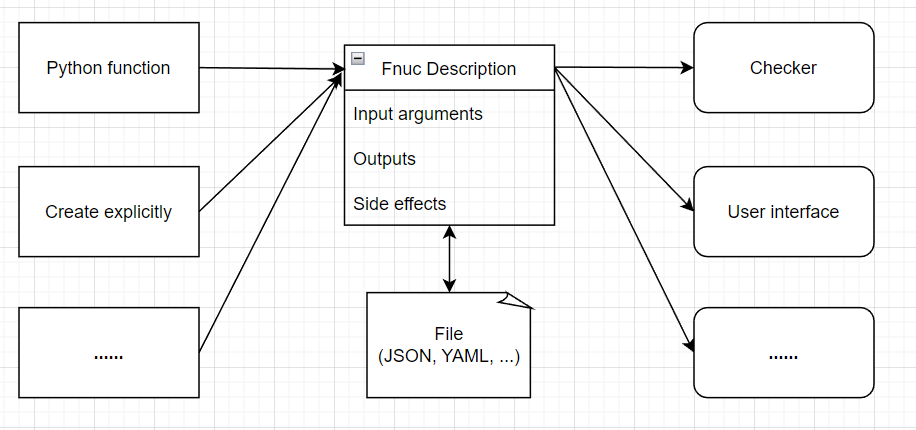

<div align="center">
  <h1> funcdesc </h1>

  <p> Establish a general function description protocol, which can realize a comprehensive description of the input, output and side effects of an target function through an Python object. Provide a unified abstraction for parameter checking, interface generation and other functions in applications such as oneFace. </p>

  <p>
    <a href="https://github.com/Nanguage/funcdesc/actions/workflows/build_and_test.yml">
        
    </a>
    <a href="https://app.codecov.io/gh/Nanguage/funcdesc">
        
    </a>
    <a href="https://pypi.org/project/funcdesc/">
      
    </a>
    <a href="https://github.com/Nanguage/funcdesc/blob/master/LICENSE">
      
    </a>
  </p>
</div>


## Features

* Parse function to get a description object.
* Mark function's inputs and outputs.
* Mark function's side effects.
* Generate checker(guard) for function.
  + Check inputs and outputs's type.
  + Check inputs and outputs's range.
  + Check side-effect.
* Serialization & Deserialization of the description.
  + Convert description object to JSON string.
  + **TODO** Parse JSON string to get description object.
* Utility functions for edit function's signature.


## Concept

"Function description" is a Python object that contains descriptive information about a Python function, such as input parameters, output values, and side effects of the function. The description of the inputs and outputs includes their types, range of values, and default values.

The `Description` can be generated by parsing a function annotated with type annotations and decorated with the mark decorator, 
or it can be manually created. After obtaining the `Description`, 
we can use it to generate a  `Guard` object to check the types, ranges, or side effects of the inputs and outputs of the function at runtime. 
Additionally, the information in the `Description` can be used by downstream tools, such as [oneFace](https://github.com/Nanguage/oneFace), to automatically generate interfaces, including CLI, GUI, and WebUI




## Demo

### Create description object

Parse a normal type hinted function:

```Python
# test.py
from funcdesc import parse_func

def add(a: int, b: int = 0) -> int:
    return a + b

desc = parse_func(add)
print(desc)
```

```
$ python test.py
<Description
        inputs=[<Value type=<class 'int'> range=None default=NotDef>, <Value type=<class 'int'> range=None default=0>]
        outputs=[<Value type=<class 'int'> range=None default=NotDef>]
        side_effects=[]
>
```

#### Mark inputs and outputs

`funcdesc` provides two ways to annotate inputs and outputs: 1) using decorators, and 2) using the "Val" object in type hints.
For example:

```Python
from funcdesc import mark_input, mark_output

@mark_input(0, type=int, range=[0, 10])
@mark_input(1, type=int, range=[0, 10])
@mark_output(0, type=int, range=[0, 20])
def add(a, b) -> int:
    return a + b
```

Is same to:

```Python
from funcdesc import Val

def add(a: Val[int, [0, 10]], b: Val[int, [0, 10]]) -> Val[int, [0, 20]]:
    return a + b
```

### Create function guard

The `make_guard` decorator can convert a marked function into a `Guard` object.
You can call the `Guard` just like the original function, and it will check the inputs, outputs,
and side effects of the function based on the marked information.
For example:

``` Python
from funcdesc import mark_input, mark_output, make_guard

@make_guard
@mark_input('a', range=[0, 10])
@mark_input('b', range=[0, 10])
@mark_output(0, name="sum", range=[0, 20])
def add(a: int, b: int) -> int:
    return a + b

print(add(5, 5))  # will print "10"
print(add(20, 20))  # will raise an CheckError
```

```bash
$ python tmp/test.py
10
Traceback (most recent call last):
  File ".\tmp\test2.py", line 11, in <module>
    print(add(20, 20))  # will raise an CheckError
  File "C:\Users\Nangu\Desktop\funcdesc\funcdesc\guard.py", line 46, in __call__
    self._check_inputs(pass_in, errors)
  File "C:\Users\Nangu\Desktop\funcdesc\funcdesc\guard.py", line 58, in _check_inputs
    raise CheckError(errors)
funcdesc.guard.CheckError: [ValueError('Value 20 is not in a valid range([0, 10]).'), ValueError('Value 20 is not in a valid range([0, 10]).')]
```


### Builtin types

`funcdesc` provides some built-in types to facilitate the use of the `guard`.

#### Builtin Value types

`OneOf` and `SubSet`.

```Python
from funcdesc import mark_input, make_guard
from funcdesc.types import SubSet, OneOf


member_list = ["Tom", "Jerry", "Jack"]
food_list = ["apple", "dumpling", "noodles", "banana"]


@make_guard
@mark_input(0, type=OneOf, range=member_list)
@mark_input(1, type=SubSet, range=food_list)
def eat(person, foods):
    print(f"{person} eats {' '.join(foods)}")


eat("Tom", ["apple", "dumpling"])
eat("Jack", ["banana", "noodles"])
eat("Jared", ["apple"])  # "Jared" not in member_list, will raise exception
eat("Tom", ["fish"])  # "fish" not in foods_list, will raise exception
```

`InputPath` and `OutputPath`

```Python
from funcdesc.types import InputPath, OutputPath
from funcdesc import make_guard


@make_guard
def copy_file(in_path: InputPath, out_path: OutputPath):
    with open(in_path) as fi, open(out_path, 'w') as fo:
        fo.write(fi.read())


copy_file("file_exist", "another_file")
copy_file("file_not_exist", "another_file")  # will raise exception
```


### Change function's signature

funcdesc also provides some utility functions for modifying function signature, in order to annotate functions with variable-length parameter types.

Change the parameters signature:

```Python
import inspect
from funcdesc.mark import sign_parameters

@sign_parameters("a", ("b", int), ("c", int, 10))
def f(*args) -> int:
    return sum(args)

# The signature of `f` is changed
sig = inspect.signature(f)
assert len(sig.parameters) == 3
assert sig.parameters["a"].annotation is inspect._empty
assert sig.parameters["b"].annotation is int
assert sig.parameters["c"].default == 10
```

Change the return signature:

```Python
import inspect
from funcdesc.mark import sign_return

@sign_return(str)
def f(a: int):
    return str(a)

# The signature of `f` is changed
sig = inspect.signature(f)
assert sig.return_annotation is str
```

Copy the signature of a function to another function:

```Python
import inspect
from funcdesc.mark import copy_signature

def f(a: int) -> str:
    return str(a)

@copy_signature(f)
def g(b):
    return str(b)

# The signature of `g` is copied from `f`
sig = inspect.signature(g)
assert sig.parameters["a"].annotation is int
assert sig.return_annotation is str
```

Generate a `Signature` object from `Description` object:

```Python
from funcdesc import parse_func

def f(a: int) -> str:
    return str(a)

desc = parse_func(f)
sig = desc.compose_signature()
print(sig) # will print: (a: int) -> str
```

## Related projects

+ [oneFace](https://github.com/Nanguage/oneFace): Generating interfaces(CLI, Qt GUI, Dash web app) from a Python function or a command program.
